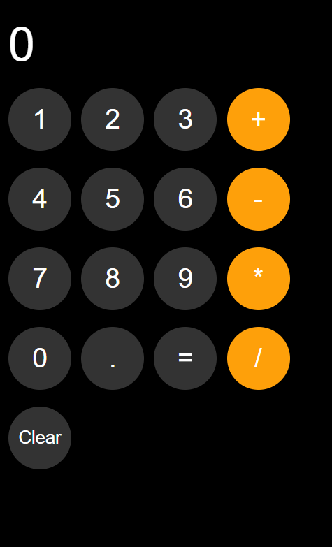
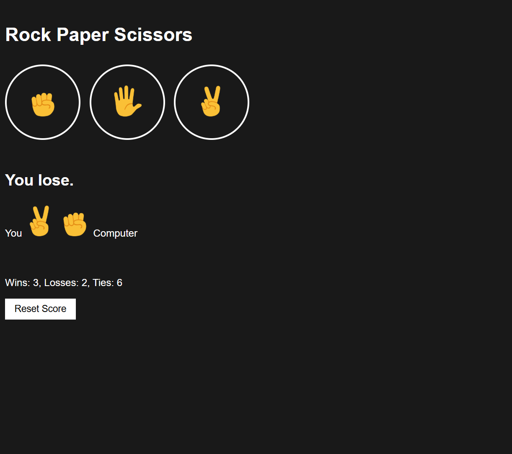

# JavaScript Course Projects

A collection of beginner to intermediate JavaScript projects completed during my front-end development learning journey. This repository serves as a practice archive and internship portfolio.

---

## 📸 Project Previews

### 📦 Amazon Website Project  
A simple front-end website layout inspired by Amazon's homepage.

---

### 🧮 Complete Calculator  
A functional, interactive calculator built using HTML, CSS, and JavaScript.

---

### ✊🖐✌️ Rock Paper Scissors Game  
A classic game recreated using JavaScript, allowing the user to play against a computer opponent.

---

## ✨ Features

- Multiple beginner-to-intermediate JavaScript projects
- Responsive layout designs (where applicable)
- Interactive JavaScript functionality
- Clean and simple user interfaces

---

## 📌 Purpose

To practice and reinforce JavaScript concepts through small, hands-on projects — and to build a personal showcase repository for internship applications.

---

## 🛠️ Tools & Technologies

- HTML
- CSS
- JavaScript
- Visual Studio Code
- Git & GitHub

---

